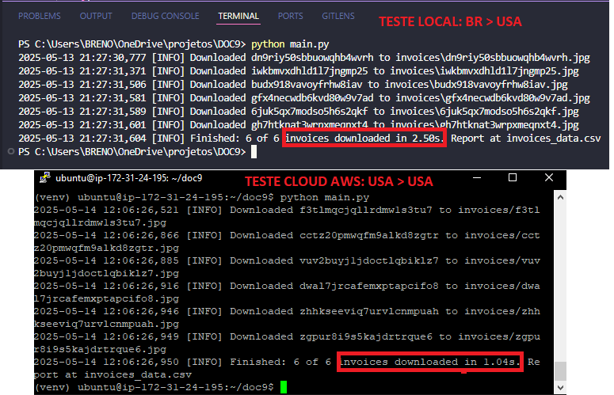

# Invoice Fetcher

Projeto de automação para coleta de faturas vencidas através de uma tabela do site [rpachallenger](https://rpachallengeocr.azurewebsites.net/). A automação realiza o download das faturas e gera um relatório CSV com informações relevantes.

---

## 🧠 Decisões Técnicas

Inicialmente, a automação foi construída utilizando Selenium para simular a interação com o site. No entanto, esse método apresentava desempenho insatisfatório e alta fragilidade frente a mudanças no front-end (como alterações em `xpath` ou `ids` etc).

Ao investigar a comunicação do site via DevTools, foi identificado que a tabela de faturas era alimentada por uma API. Com isso, o projeto foi reestruturado para consumir diretamente as informações da `DataTable` utilizando a biblioteca `aiohttp`, o que resultou em:
- Maior velocidade de execução
- Código mais simples e robusto
- Eliminação de dependências frágeis de front-end

---

## ✅ Funcionalidades

- Consumo assíncrono de API com `aiohttp`
- Filtro de faturas vencidas ou com vencimento no dia atual
- Download automático dos arquivos das faturas
- Geração de relatório `CSV` contendo:
  - Número da fatura
  - Data da fatura
  - URL da fatura
- Armazenamento dos arquivos em uma pasta `invoices/`

---

## 📐 Boas Práticas

O projeto segue boas práticas como:
- Organização modular (separação de responsabilidades entre fetcher, downloader, config e main)
- Tipagem com `typing`
- Logging estruturado
- Manipulação de erros e falhas de rede
- Uso de bibliotecas modernas e eficientes (`aiohttp`)
- Compatibilidade com execução local e CI com testes automatizados (`pytest`)

---

## ▶️ Como Executar

1. Instale as dependências:

```bash
pip install -r requirements.txt
```

2. Execute o script principal:

```bash
python main.py
```

Por padrão, os arquivos serão salvos em:
- Pasta: `invoices/`
- Relatório: `invoices_data.csv`

---

## 🧪 Testes

Há 3 testes automatizados cobrindo as principais funcionalidades:
- Validação do retorno da API
- Verificação do filtro de datas vencidas
- Teste do processo de download

Execute os testes com:

```bash
pytest
```

---

## 🚀 Benchmark e Performance

O uso de `aiohttp` com `TCPConnector` e `ClientSession` permitiu controlar o número máximo de conexões simultâneas e tempo de timeout, otimizando o desempenho.

⚠️ A API está hospedada nos Estados Unidos, o que introduz uma latência natural nas requisições. Testes em ambiente local apresentaram tempos entre 2-4 segundos.

💡 Para testes de performance, foi utilizada uma máquina virtual AWS localizada nos EUA. Nessas condições, o tempo médio de execução ficou em torno de **1 segundo**, evidenciando o impacto da latência de rede.


---

## 🛠️ Principais Ferramentas

- Python 3.10+
- `aiohttp` (requisições assíncronas)
- `pytest` (testes automatizados)

---

## 📦 Requisitos

```txt
aiohttp==3.11.18
aiohappyeyeballs==2.6.1
aiosignal==1.3.2
attrs==25.3.0
colorama==0.4.6
frozenlist==1.6.0
idna==3.10
iniconfig==2.1.0
multidict==6.4.3
packaging==25.0
pluggy==1.5.0
propcache==0.3.1
pytest==8.3.5
pytest-asyncio==0.26.0
yarl==1.20.0
```

---

## 📁 Estrutura do Projeto

```
├── main.py              # Orquestração do fluxo principal
├── fetcher.py           # Coleta e filtragem de faturas
├── downloader.py        # Download dos arquivos
├── config.py            # Configurações e constantes
├── invoices/            # Pasta onde as faturas são salvas
├── invoices_data.csv    # Relatório gerado
└── tests/               # Pasta com testes automatizados
```
